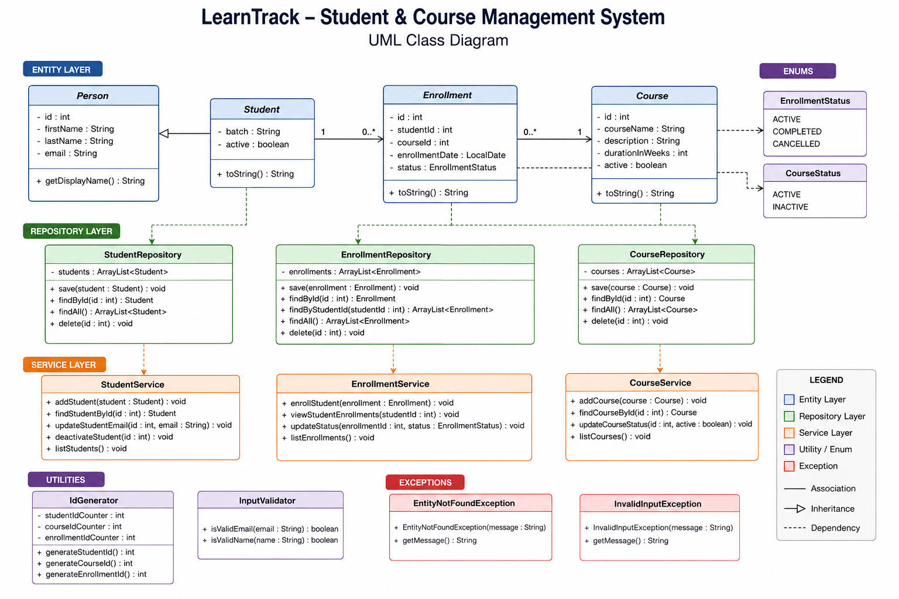

# LearnTrack - Student & Course Management System

## Project Overview

LearnTrack is a console-based Student & Course Management System developed using Core Java. It allows administrators to manage students, courses, and enrollments through a menu-driven console application.

The project is designed to demonstrate the fundamentals of Java programming, Object-Oriented Programming (OOP), Collections, Exception Handling, and clean project architecture.

---

## Features

### Student Management
- Add Student
- View All Students
- Search Student by ID
- Deactivate Student

### Course Management
- Add Course
- View All Courses
- Activate/Deactivate Course

### Enrollment Management
- Enroll Student into Course
- View Student Enrollments
- Update Enrollment Status (ACTIVE, COMPLETED, CANCELLED)

---

## Concepts Demonstrated

### Core Java
- Variables and Data Types
- Control Statements
- Loops
- Methods
- Packages

### Object-Oriented Programming
- Classes & Objects
- Encapsulation
- Inheritance
- Constructor Overloading
- Method Overriding
- Polymorphism

### Collections
- ArrayList

### Exception Handling
- Custom Exceptions
- try-catch
- Input Validation

### Utility Classes
- Static Methods
- Static Variables

---

## Project Structure

```
LearnTrack
│
├── src
│   └── com
│       └── airtribe
│           └── learntrack
│               ├── Main.java
│               │
│               ├── entity
│               │   ├── Person.java
│               │   ├── Student.java
│               │   ├── Course.java
│               │   └── Enrollment.java
│               │
│               ├── repository
│               │   ├── StudentRepository.java
│               │   ├── CourseRepository.java
│               │   └── EnrollmentRepository.java
│               │
│               ├── service
│               │   ├── StudentService.java
│               │   ├── CourseService.java
│               │   └── EnrollmentService.java
│               │
│               ├── util
│               │   ├── IdGenerator.java
│               │   └── InputValidator.java
│               │
│               ├── exception
│               │   ├── EntityNotFoundException.java
│               │   └── InvalidInputException.java
│               │
│               ├── constants
│               │   ├── AppConstants.java
│               │   └── MenuOptions.java
│               │
│               └── enums
│                   ├── EnrollmentStatus.java
│                   └── CourseStatus.java
│
├── docs
│   ├── Setup_Instructions.md
│   ├── JVM_Basics.md
│   └── Design_Notes.md
│
└── README.md
```

---

## Technologies Used

- Java
- JDK 21 (or your installed version)
- IntelliJ IDEA
- Git
- GitHub

---

## How to Run the Project

### Compile

```
javac src/com/airtribe/learntrack/Main.java
```

### Run

```
java com.airtribe.learntrack.Main
```

Or simply run **Main.java** from IntelliJ IDEA.

---

## Class Diagram

```
                     Person
                        ▲
                        │
                  +-----------+
                  |  Student  |
                  +-----------+

Student -------- Enrollment -------- Course
```


---


## Why ArrayList?

ArrayList was used because it provides dynamic storage and allows adding or removing objects during runtime without defining a fixed size.

---

## Where Static Members Are Used

The `IdGenerator` class uses static variables and static methods to generate unique IDs for:

- Students
- Courses
- Enrollments

---

## Where Inheritance Is Used

`Student` extends `Person`.

Common fields such as:

- id
- firstName
- lastName
- email

are inherited from the `Person` class, reducing code duplication and improving code reusability.

---

## Future Enhancements

- File-based persistence
- Database integration (MySQL)
- Login Authentication
- Trainer Management
- Search by Name
- Update Student Details
- Delete Student/Course
- GUI using JavaFX or Swing

---

## Author

**Sruthi Palla**

---

## GitHub Repository

```
https://github.com/SruthiPalla/LearnTrack
```